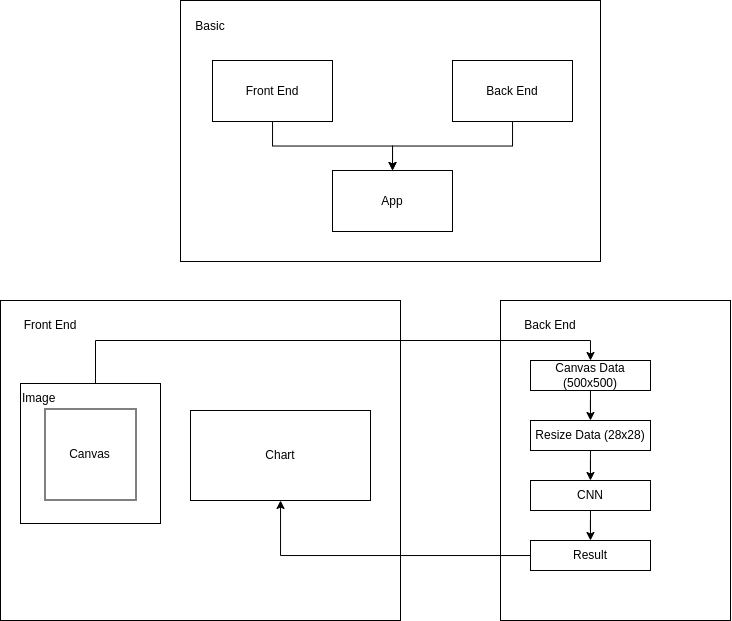
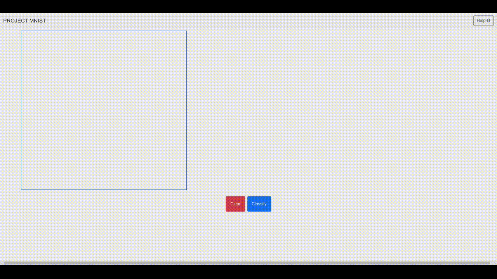

# PROJECT MNIST 

## Introduction
It's a fun project created to interact with the MNIST model.
A web app with a canvas to draw numbers and then predict the number using the MNIST model.
There is also a chart to show percentages given for each number.

## Flowchart

## Demo

